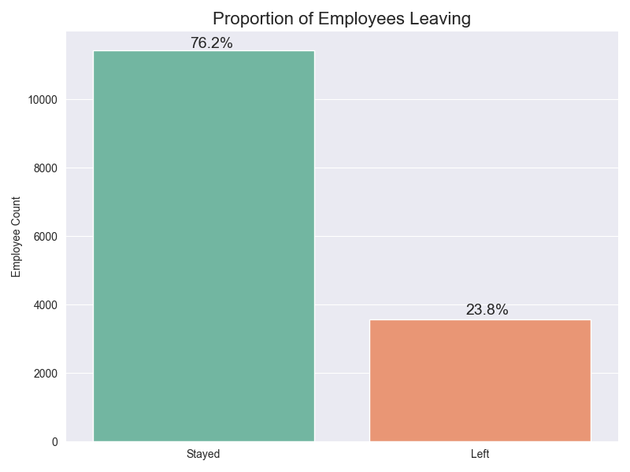

# Predicting Employee Turnover Rates

### Overview
The goal of this project was to create a predictive model either through multiple logistic regression or through machine learning algorithms such as Random Forest Classifers or Categorical Gradient Boosting estimators. This project utilized employee statistics recorded by Salifort Motors and is the capstone project for Google's Advance Data Analytics Professional Certificate. The champion model for this analysis was a random forest with tuned hyper-parameters. The following metrics were used to evaluate the algorithm's success.

|Model Name|F1 Score|Precision|Recall|Accuracy|
|:---:|:---:|:---:|:---:|:---:|
|Tuned Random Forest| 97.21%| 98.47%| 95.98%| 98.65%|

The random forest model determined the most relevant features for separating employees that are likely to leave to those who won't are `satisfaction_level`, `time_spent_with_company`, and `hours_per_project`. We note that the latter features was engineered and that it represents the employees engagement to the company's goals.

### Business Understanding
We clearly see that salary is not a leading factor for employee turnover rates, instead we see that employee activty, tenure and satisfaction are good indicators of longevity. Another important aspect of this project was to determine the best way to invest in employee training and resources without losing skilled workers. After conducting forms of hypothesis testing, we noticed that the Tech. Department has higher likelihoods to have employees who won't leave the company. So if we were to recommend a department for investing in training that would be this department.

### Data Understanding
The Salifort Motors data was synthetically generated by Google for the purpose of this project. The data consisted of approximately 12k unique employees and 9 features per employee. The features included information on employee satisfaction, evaluation, salary, company history, department, and contributed projects. The bar chart below shows the proportion of employee leaving Salifort Motors

